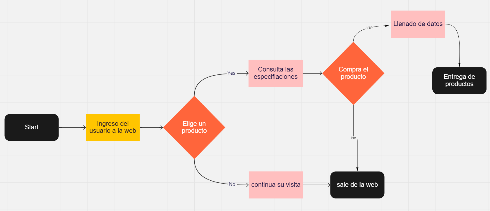
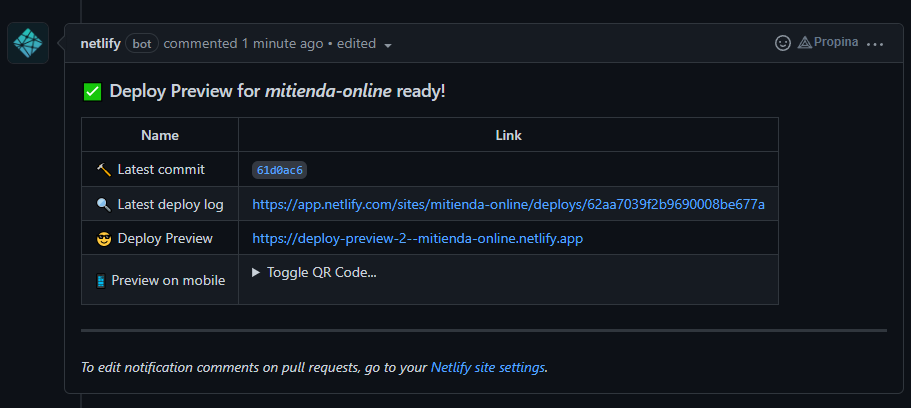
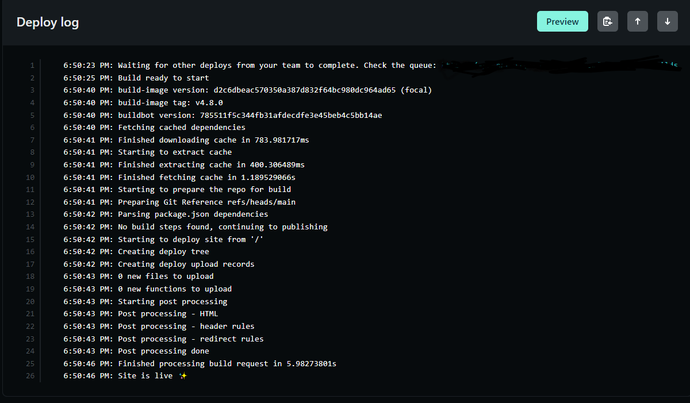

## Problematica

Esta fue una aplicacion que se desarrollo para una tienda online. la cual no contaba con un sistema para poder ofertar sus productos asi que se llego a la solucion de realizar una pagina web en la cual se puedan mostrar los productos que se encuentran en la tienda. Se implementara un ecommerce en el cual se puedan vender en linea.

## Diagrama de la estructura de la pagina 

Aquí se muestra el diagrama de el funcionamiento de la pagina web.

## Capturas del sitio
Imagen para mostrar como es la pagina desplegada en hosting, en este caso se encuentra desplegada en netlify.

Visitar la pagina web en el siguiente [link](https://mitienda-online.netlify.app/)

## Manual para mantainers

Para visitar el manual siga el siguiente enlace [manual](./views/manual.md) donde se mostrara informacion mas especifica de como se puede agregar cambios a la pagina web.

## Pruebas para la pagina

En este caso se hizo una prueba para verificar que la pagina funciona correctamente. para ello se uso github como plataforma para guardar los archivos y este asu vez los procesa en netlify automaticamente.

Despues en la pagina de netlify se puede mostrar el log del proceso de deploy en netlify donde se clona el repositorio para despues ponerlo en linea para que pueda ser visualizado.

> **Nota:**
> Este pagina aun se encuentra en construcción para el funcionamiento de venta en linea.